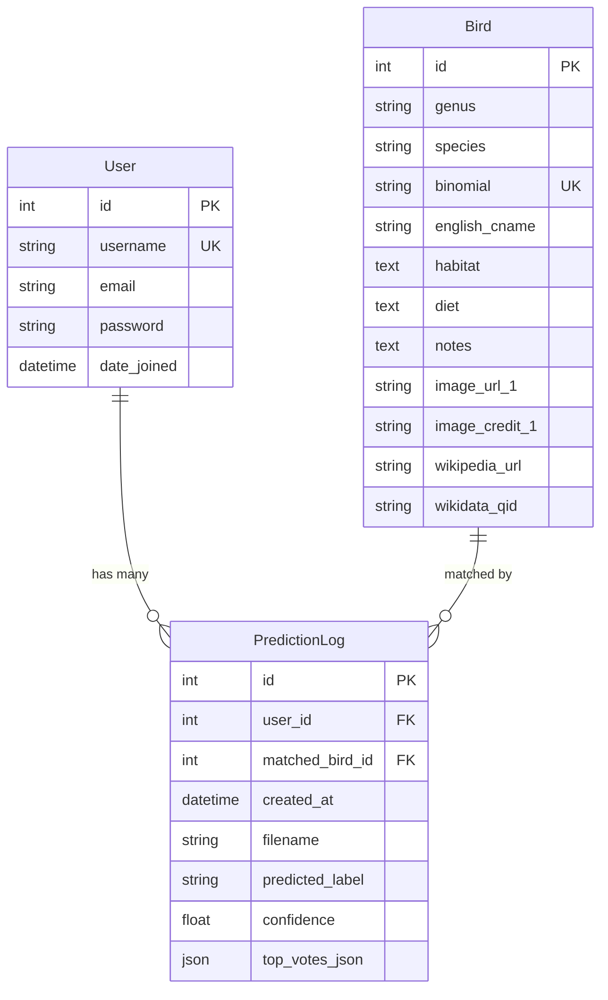

# Entity Relationship Diagram (ER Diagram)

## Database Schema

### ER Diagram

```
┌─────────────────────────────────────────────────────────────┐
│                    DATABASE SCHEMA                          │
└─────────────────────────────────────────────────────────────┘

┌─────────────────────────────────────────────────────────┐
│                      User                                │
│              (django.contrib.auth.User)                  │
├─────────────────────────────────────────────────────────┤
│ PK  id                  INTEGER PRIMARY KEY              │
│     username            VARCHAR(150) UNIQUE              │
│     email               VARCHAR(254)                     │
│     password            VARCHAR(128) [hashed]            │
│     first_name          VARCHAR(150)                     │
│     last_name           VARCHAR(150)                     │
│     is_active           BOOLEAN                          │
│     is_staff            BOOLEAN                          │
│     is_superuser        BOOLEAN                          │
│     date_joined         DATETIME                         │
│     last_login          DATETIME                         │
└────────────────────┬────────────────────────────────────┘
                     │
                     │ 1:N
                     │ (one user has many predictions)
                     │
                     ▼
┌─────────────────────────────────────────────────────────┐
│                  PredictionLog                           │
├─────────────────────────────────────────────────────────┤
│ PK  id                  INTEGER PRIMARY KEY              │
│ FK  user_id             INTEGER → User.id                │
│                         (CASCADE on delete)              │
│ FK  matched_bird_id     INTEGER → Bird.id (NULLABLE)    │
│                         (SET_NULL on delete)             │
│     created_at          DATETIME (auto_now_add)          │
│     filename            VARCHAR(255)                     │
│     predicted_label     VARCHAR(140)                     │
│     confidence          FLOAT (0.0-1.0)                  │
│     top_votes_json      JSON (dict)                      │
│                                                          │
│ INDEXES:                                                │
│   - (user_id, -created_at)                              │
│   - created_at (DESC)                                   │
└────────────────────┬────────────────────────────────────┘
                     │
                     │ N:1
                     │ (many predictions can match one bird)
                     │
                     ▼
┌─────────────────────────────────────────────────────────┐
│                      Bird                                │
├─────────────────────────────────────────────────────────┤
│ PK  id                  INTEGER PRIMARY KEY              │
│     genus               VARCHAR(64)                      │
│     species             VARCHAR(64)                      │
│ UK  binomial            VARCHAR(140) UNIQUE              │
│                         "Genus species"                  │
│     english_cname       VARCHAR(140)                     │
│     habitat             TEXT                             │
│     diet                TEXT                             │
│     notes               TEXT                             │
│     image_url_1         VARCHAR(200) [URL]               │
│     image_credit_1      VARCHAR(255)                     │
│     image_url_2         VARCHAR(200) [URL]               │
│     image_credit_2      VARCHAR(255)                     │
│     image_url_3         VARCHAR(200) [URL]               │
│     image_credit_3      VARCHAR(255)                     │
│     wikipedia_title     VARCHAR(255)                     │
│     wikipedia_url       VARCHAR(200) [URL]               │
│     wikidata_qid        VARCHAR(32)                      │
│                                                          │
│ INDEXES:                                                │
│   - (genus, species)                                    │
│   - binomial                                            │
└─────────────────────────────────────────────────────────┘
```

## Relationships

### User ↔ PredictionLog
- **Type**: One-to-Many (1:N)
- **Relationship**: One user can have many predictions
- **Foreign Key**: `PredictionLog.user_id → User.id`
- **On Delete**: CASCADE (if user is deleted, all their predictions are deleted)
- **Nullable**: Yes (for backward compatibility with old predictions)

### Bird ↔ PredictionLog
- **Type**: Many-to-One (N:1)
- **Relationship**: Many predictions can match one bird
- **Foreign Key**: `PredictionLog.matched_bird_id → Bird.id`
- **On Delete**: SET_NULL (if bird is deleted, prediction remains but bird reference is null)
- **Nullable**: Yes (predictions may not match any bird in database)

## Entity Descriptions

### User
- **Source**: Django's built-in User model
- **Purpose**: Stores user authentication and profile information
- **Key Fields**:
  - `username`: Unique identifier for login
  - `email`: User's email address
  - `password`: Hashed password (never stored in plain text)
- **Relationships**:
  - Has many PredictionLog entries
  - Each prediction belongs to one user

### Bird
- **Source**: Custom model in `birds/models.py`
- **Purpose**: Stores bird species information
- **Key Fields**:
  - `binomial`: Scientific name (unique identifier)
  - `genus`: Genus name
  - `species`: Species name
  - `english_cname`: Common name
  - `habitat`: Habitat information (from Wikidata)
  - `diet`: Diet information (from Wikidata)
  - `notes`: General notes (from Wikipedia)
  - `image_url_1/2/3`: Image URLs (from Wikidata/Wikipedia)
  - `image_credit_1/2/3`: Image credits
  - `wikipedia_title`: Wikipedia page title
  - `wikipedia_url`: Wikipedia page URL
  - `wikidata_qid`: Wikidata entity ID
- **Relationships**:
  - Can have many PredictionLog entries (when predictions match)
  - Each prediction can match at most one bird

### PredictionLog
- **Source**: Custom model in `birds/models.py`
- **Purpose**: Stores each prediction made by users
- **Key Fields**:
  - `user`: Foreign key to User (who made the prediction)
  - `matched_bird`: Foreign key to Bird (matched species, nullable)
  - `created_at`: Timestamp of prediction
  - `filename`: Original audio filename
  - `predicted_label`: Predicted species label
  - `confidence`: Confidence score (0.0-1.0)
  - `top_votes_json`: Top 5 predictions with vote counts
- **Relationships**:
  - Belongs to one User
  - Can match one Bird (or none)
  - Ordered by `created_at` descending (newest first)

## Database Constraints

### Primary Keys
- `User.id`: Primary key (auto-increment)
- `Bird.id`: Primary key (auto-increment)
- `PredictionLog.id`: Primary key (auto-increment)

### Unique Constraints
- `User.username`: Unique (no duplicate usernames)
- `Bird.binomial`: Unique (no duplicate scientific names)

### Foreign Key Constraints
- `PredictionLog.user_id → User.id`: CASCADE on delete
- `PredictionLog.matched_bird_id → Bird.id`: SET_NULL on delete

### Indexes
- `Bird(genus, species)`: Composite index for fast genus/species lookups
- `Bird(binomial)`: Index for fast binomial lookups
- `PredictionLog(user_id, -created_at)`: Composite index for fast user history queries
- `PredictionLog(created_at)`: Index for ordering

## Data Flow

### Creating a Prediction
1. User uploads audio file
2. System creates PredictionLog entry
3. System links PredictionLog to User
4. System predicts species
5. System searches for matching Bird
6. System links PredictionLog to Bird (if found)

### Querying User History
1. Query PredictionLog where user_id = current_user.id
2. Order by created_at descending
3. Join with Bird table to get bird details
4. Return results

### Enriching Bird Data
1. Query Bird records
2. Fetch data from Wikipedia/Wikidata
3. Update Bird fields (habitat, diet, notes, images)
4. Save updated Bird record

## Mermaid Diagram



## Table Specifications

### User Table
- **Table Name**: `auth_user`
- **Engine**: SQLite (development), PostgreSQL (production)
- **Charset**: UTF-8
- **Collation**: utf8_general_ci

### Bird Table
- **Table Name**: `birds_bird`
- **Engine**: SQLite (development), PostgreSQL (production)
- **Charset**: UTF-8
- **Collation**: utf8_general_ci

### PredictionLog Table
- **Table Name**: `birds_predictionlog`
- **Engine**: SQLite (development), PostgreSQL (production)
- **Charset**: UTF-8
- **Collation**: utf8_general_ci

## Data Types

### String Fields
- `CharField`: Fixed or maximum length strings
- `TextField`: Unlimited length strings
- `URLField`: URL strings (validated)

### Numeric Fields
- `IntegerField`: Integer values
- `FloatField`: Floating-point values

### Date/Time Fields
- `DateTimeField`: Date and time values
- `auto_now_add`: Automatically set on creation
- `auto_now`: Automatically set on update

### Other Fields
- `JSONField`: JSON data (dictionaries, lists)
- `ForeignKey`: Relationships to other models
- `BooleanField`: Boolean values

## Sample Data

### User Sample
```python
{
    "id": 1,
    "username": "john_doe",
    "email": "john@example.com",
    "first_name": "John",
    "last_name": "Doe",
    "date_joined": "2025-11-11T10:00:00Z",
    "is_active": True,
    "is_staff": False,
    "is_superuser": False
}
```

### Bird Sample
```python
{
    "id": 1,
    "genus": "Sylvia",
    "species": "communis",
    "binomial": "Sylvia communis",
    "english_cname": "Common Whitethroat",
    "habitat": "Shrubland, woodland",
    "diet": "Insects, berries",
    "notes": "The common whitethroat is a common...",
    "image_url_1": "https://commons.wikimedia.org/...",
    "image_credit_1": "File:Common_Whitethroat.jpg",
    "wikipedia_title": "Common whitethroat",
    "wikipedia_url": "https://en.wikipedia.org/wiki/Common_whitethroat",
    "wikidata_qid": "Q25251"
}
```

### PredictionLog Sample
```python
{
    "id": 1,
    "user_id": 1,
    "matched_bird_id": 1,
    "created_at": "2025-11-11T12:00:00Z",
    "filename": "recording.webm",
    "predicted_label": "Sylvia communis",
    "confidence": 0.85,
    "top_votes_json": {
        "Sylvia communis": 8,
        "Sylvia atricapilla": 2,
        "Sylvia borin": 1
    }
}
```

## Database Queries

### Get User Predictions
```python
predictions = PredictionLog.objects.filter(user=user).order_by('-created_at')
```

### Get Bird by Binomial
```python
bird = Bird.objects.filter(binomial__iexact=binomial).first()
```

### Get Predictions for Bird
```python
predictions = PredictionLog.objects.filter(matched_bird=bird)
```

### Get User History with Bird Details
```python
predictions = PredictionLog.objects.filter(user=user).select_related('matched_bird')
```

---

This ER diagram provides a complete overview of the database schema and relationships in the Bird Sound Recognition System.
